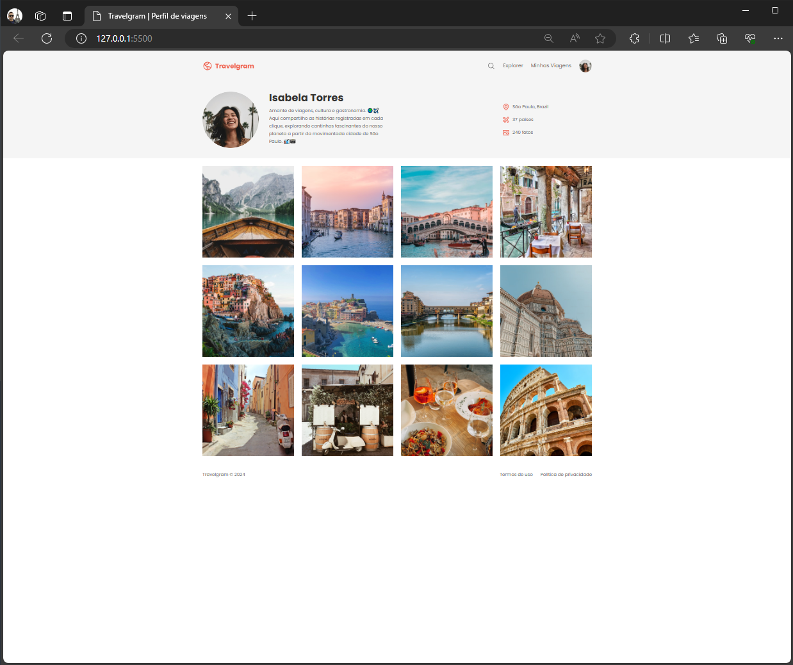

# Projeto de landing page Travelgram

Utilizando apenas conceitos de HTML 5 e CSS 3.

Foco na estilização usando **Flexbox**
```css
display: flex;
```

Demo: <https://tiagomartinscc.github.io/projeto-travelgram/>




